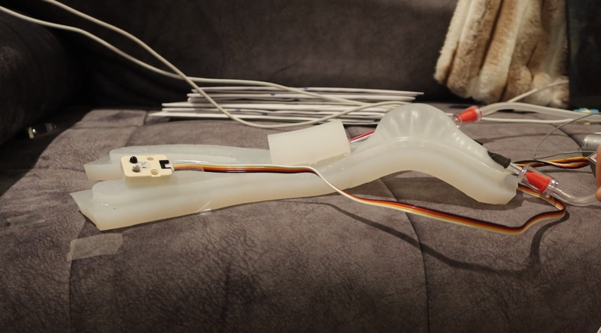
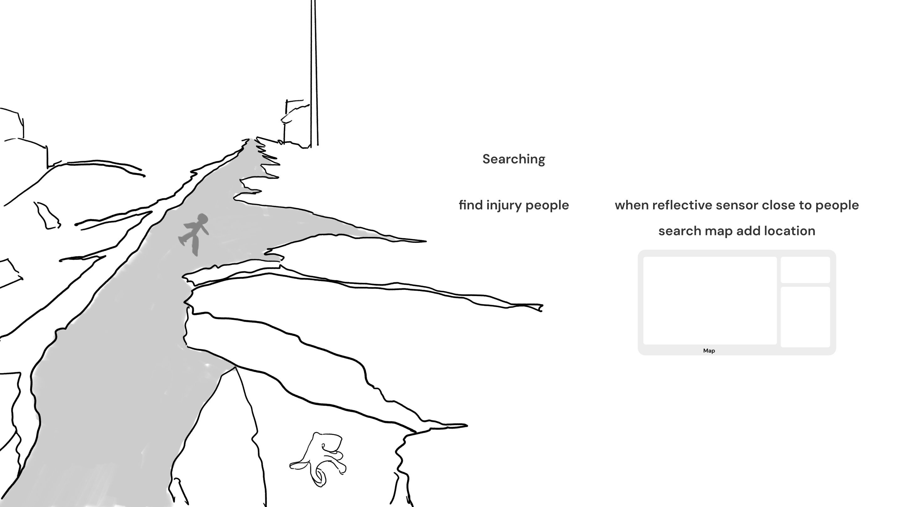
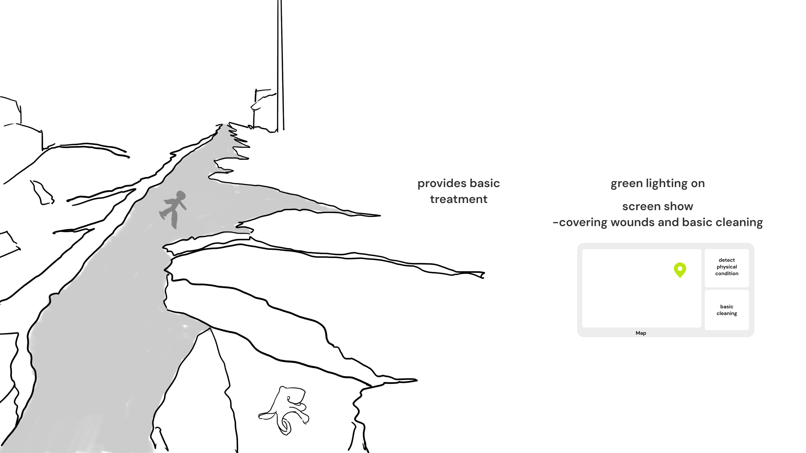
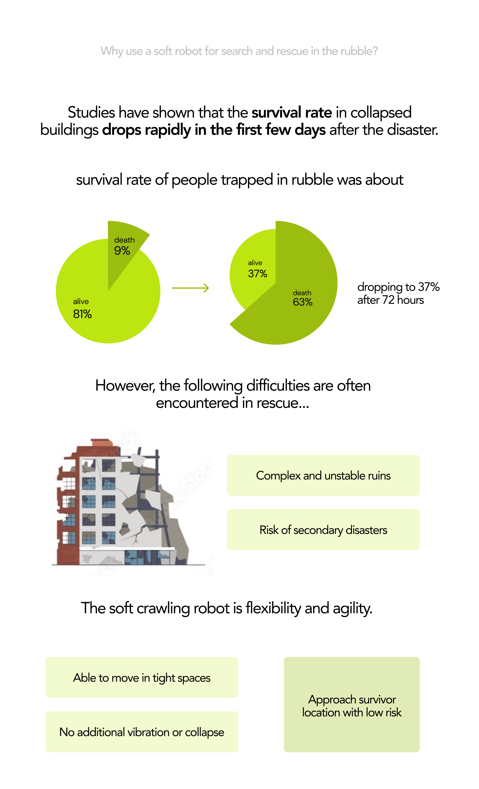
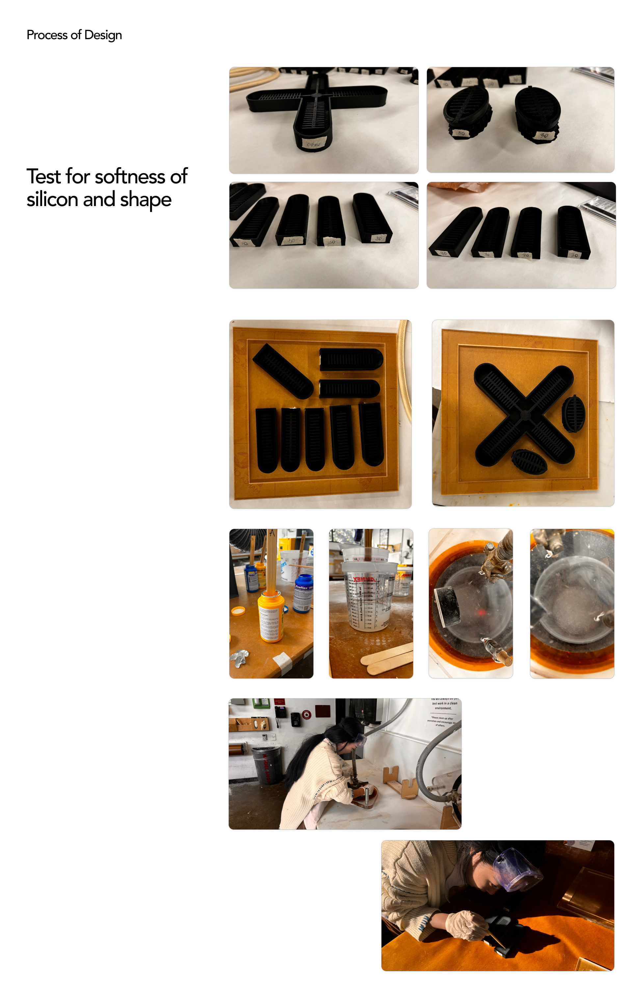
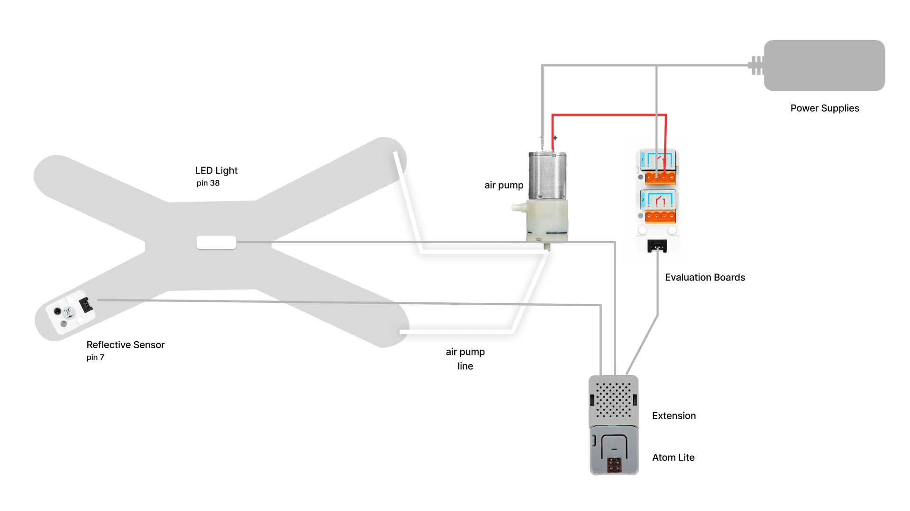
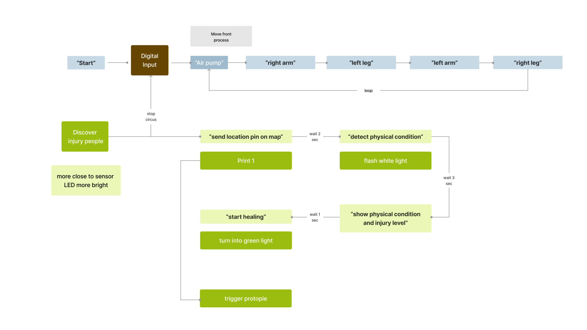

## Final Project Soft Robot Rescue
This project explores a soft robotic crawling tentacle designed for disaster search and rescue. 
With its ability to maneuver through tight spaces, 
it can navigate collapsed buildings and narrow gaps to locate trapped survivors, 
reaching areas inaccessible to traditional rescue equipment or larger robots.

Flexible, Precise, and Reliable.
youtube link：https://youtu.be/oU1JH4KOAWk

Here is one cover image:



### Part 1 - Introduction of my initial project idea
Here is my first ideation of sketch:  

This project uses a soft robot and reflective sensors for post-disaster search and rescue. The soft tentacles can pass through small spaces and the sensors can detect the presence of survivors. The robot can adjust its movements based on detected light and obstacles, while using green light to indicate the location of discovered survivors and provide simple medical support. The success of the rescue depends on the robot being able to safely reach the survivors and provide initial assistance.



  





### Part 2 - Process of making soft robot
I designed a soft robotic model inspired by octopus tentacles, focusing on its flexibility and crawling capability. The model was developed in Rhino and fabricated using silicone materials to ensure softness and durability. The crawling mechanism uses a pneumatic system to simulate the expansion and contraction of the tentacle. Reflective sensors were integrated into the design to detect light intensity and locate obstacles or survivors in disaster scenarios. Additionally, I incorporated a lightweight structure to house components such as the air pump, pressure regulator, and control module, ensuring the robot remains compact and maneuverable in tight spaces.

  

Here is the list of all the separate hardware components used in Hogwarts House Sorting Hat
* Soft Robotic Model: The core of the project, designed to mimic the flexibility and movement of octopus tentacles. It uses pneumatic chambers to enable crawling through tight spaces. 
* Extention of ATOM: In order to additional input/output ports and enhancing connectivity options.  
* Reflective Sensor: Detects light intensity and helps locate survivors or obstacles by adjusting the robot's behavior based on the surrounding environment.
* Air Pump: Provides the pneumatic pressure required to inflate and deflate the robot's chambers, enabling movement.
* Air Pressure Regulator: Ensures consistent and controllable air pressure for precise motion control of the soft tentacle.
* Control Module (M5Stack): Manages sensor input and pneumatic control, running the program that coordinates the robot's movement and detection tasks.
* LED Indicator: Provides visual feedback, such as flashing or steady green light, to indicate detected survivors or operational status during rescue missions.

 

### Part 4 - How my interactive prototype should behave
diagram that represents how my interactive prototype should behave  

  

Allow me explain the inputs/outputs used in my code and how they affect the behavior of the soft robot in Thonny.
* This function takes red, green, and blue values (0-255) as input, converts them to a single 24-bit color code, and sets the entire RGB strip to that color.
```Python
def set_rgb_color(r, g, b):
    color = (r << 16) | (g << 8) | b
    rgb2.fill_color(color)


```  

* Continuously reads the analog value from the reflective sensor, which represents the intensity of reflected light.
```Python
sensor_value = adc.read()

```  

* Checks if the sensor value is below a threshold (500), assuming this indicates the sensor is "covered" (e.g., low light or an object near it).
```Python
if sensor_value < 500:
```

* Prints 1 to indicate the sensor is covered and pauses for 3 seconds.
```Python
print("1")
time.sleep(3)

```

* Flashes the RGB light strip in white for 24 seconds (0.5 seconds on/off alternation).
```Python
while time.time() - start_time < 24:
    set_rgb_color(255, 255, 255)
    time.sleep(0.5)
    set_rgb_color(0, 0, 0)
    time.sleep(0.5)

```

* Turns on the green light for 4 seconds as a secondary visual signal.
```Python
set_rgb_color(0, 255, 0)
time.sleep(4)


```

* Prints the sensor value to monitor real-time input and ensure functionality.
```Python
print(f"Sensor Value: {sensor_value}")

```


* Calls a (presumably) separate function to adjust the RGB brightness dynamically based on the sensor value.
adjust_brightness(sensor_value)

```


* Define the adjust_brightness(sensor_value) function for clarit
```Python
def adjust_brightness(sensor_value):
    max_sensor_value = 4095
    brightness = int((1 - (sensor_value / max_sensor_value)) * 255)
    set_rgb_color(brightness, brightness, brightness)


```
### Part 5 - My complete Prototype 
Part 1: Move forward
```Python
# configure pin 8 as output:
pin8 = Pin(5, mode=Pin.OUT)

while True:           # infinite loop
  M5.update()         # update M5 board
  pin8.on()           # turn on pin 8
  time.sleep_ms(6000)  # wait for 500 milliseconds
  pin8.off()          # turn off pin 8 
  time.sleep_ms(6000)  # wait for 100 milliseconds

```

Part 2: rescue prototype link with protopie and thonny
```Python
# Initialize RGB light (white and green LED) on Pin 38
rgb2 = RGB(io=38, n=30, type="SK6812")

# Initialize reflective sensor on Pin 8
adc = ADC(Pin(8), atten=ADC.ATTN_11DB)

# Function to set RGB light color
def set_rgb_color(r, g, b):
    color = (r << 16) | (g << 8) | b  # Convert RGB values to a single color
    rgb2.fill_color(color)

# Function to adjust RGB light brightness based on sensor value
def adjust_brightness(sensor_value):
    max_sensor_value = 4095  # Assuming the sensor outputs values between 0 and 4095
    # Calculate brightness (inverse relationship: lower sensor value -> higher brightness)
    brightness = int((1 - (sensor_value / max_sensor_value)) * 255)
    set_rgb_color(brightness, brightness, brightness)  # Set LED brightness as white light

# Main loop
while True:
    # Read the sensor value from Pin 8
    sensor_value = adc.read()

    # Detect if the sensor is covered (threshold can be adjusted)
    if sensor_value < 500:  # Assume covered if below this threshold
        print("1")  # Sensor covered, sending signal
        time.sleep(3)  # Wait for 3 seconds

        # Flash white light for 24 seconds
        print("Flashing white light for 24 seconds")
        start_time = time.time()
        while time.time() - start_time < 24:  # Flash for 24 seconds
            set_rgb_color(255, 255, 255)  # Set white light
            time.sleep(0.5)  # On for 0.5 seconds
            set_rgb_color(0, 0, 0)  # Turn off
            time.sleep(0.5)  # Off for 0.5 seconds

        # Turn on green light for 4 seconds
        print("Green light ON for 4 seconds")
        set_rgb_color(0, 255, 0)  # Green light
        time.sleep(4)

        # Turn off the green light
        set_rgb_color(0, 0, 0)

    else:
        # Adjust brightness dynamically based on sensor value
        print(f"Sensor Value: {sensor_value}")  # Debug information
        adjust_brightness(sensor_value)  # Adjust LED brightness dynamically


```  

