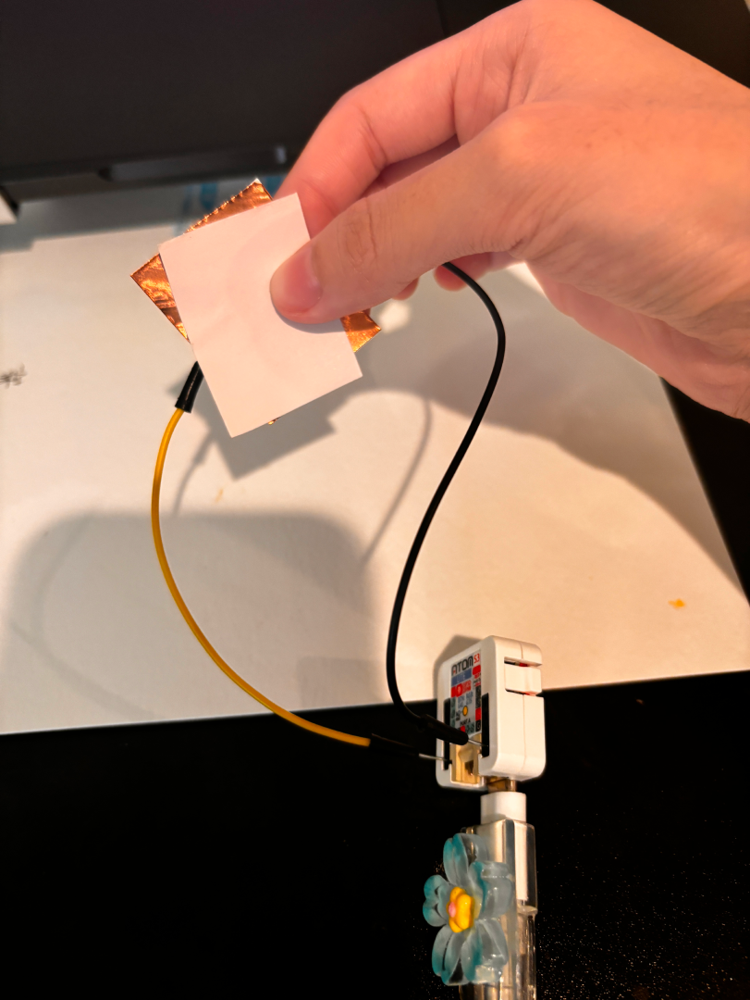

## Project 1 Hogwarts House Sorting Hat Describtion  
I designed my first project based on the impressive Sorting Hat from the Harry Potter movies. 
People wear it, and it flashes the colors representing the different schools, and then randomly assigns you to one.
House of Gryffindor in red, Ravenclaw in blue,Hufflepuff in yellow and Slytherin in green.  

Here is one image of my Hogwarts House Sorting Hat:


### Part 1 - Test Copper
After connecting to the M5, I first tested to see if the code for my copper's connection worked.

```Python
import os, sys, io
import M5
from M5 import *
from hardware import *


pin8 = None


def setup():
  global pin8

  M5.begin()
  pin8 = Pin(8, mode=Pin.IN, pull=Pin.PULL_DOWN)


def loop():
  global pin8
  M5.update()
  if pin8.value():
    print('Connect Successful')


if __name__ == '__main__':
  try:
    setup()
    while True:
      loop()
  except (Exception, KeyboardInterrupt) as e:
    try:
      from utility import print_error_msg
      print_error_msg(e)
    except ImportError:
      print("please update to latest firmware")
```


### Part 2 - Figure out where my copper should place


### Part 3 - How my interactive prototype should behave

### Part 4 - Some video records for sort into different house


[Hogwarts House Sorting Hat-code link](Code.py)

```Python
import os, sys, io
import M5
from M5 import *
from hardware import *
import time
import random

# Initialize M5 board
M5.begin()
```
