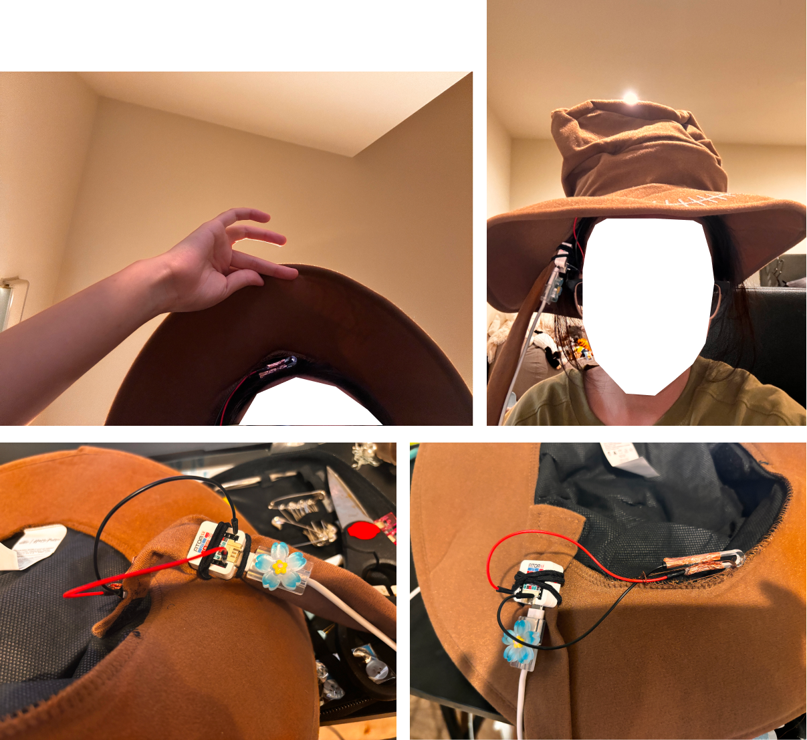
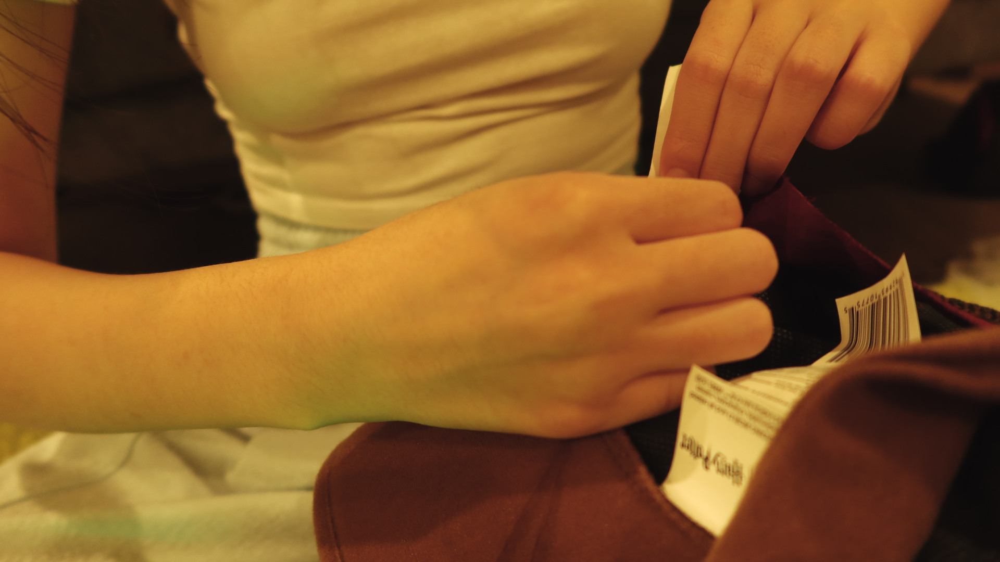

## Project 1 Hogwarts House Sorting Hat Describtion  
I designed my first project based on the impressive Sorting Hat from the Harry Potter movies. 
People wear it, and it flashes the colors representing the different schools, and then randomly assigns you to one.
House of Gryffindor in red, Ravenclaw in blue,Hufflepuff in yellow and Slytherin in green.  

Here is one image of my Hogwarts House Sorting Hat:


### Part 1 - Introduction of my initial project idea


### Part 2 - Test Copper
After connecting to the M5, I first tested to see if the code for my copper's connection worked.

```Python
import os, sys, io
import M5
from M5 import *
from hardware import *


pin8 = None


def setup():
  global pin8

  M5.begin()
  pin8 = Pin(8, mode=Pin.IN, pull=Pin.PULL_DOWN)


def loop():
  global pin8
  M5.update()
  if pin8.value():
    print('Connect Successful')


if __name__ == '__main__':
  try:
    setup()
    while True:
      loop()
  except (Exception, KeyboardInterrupt) as e:
    try:
      from utility import print_error_msg
      print_error_msg(e)
    except ImportError:
      print("please update to latest firmware")
```


### Part 3 - Figure out where my copper should place
Then I had to decide where I should put the copper, but because the hat is so soft,
the first and second places I looked were both a clip on the brim, and after putting the hat back on, 
there was compression, and the two copper overlapped. Unfortunately, because the hat is soft, the chances of success are not high.  
  

Then I had to decide where to put the copper. But because the hat was so soft, the first and second places I tried were both a clip on the brim, and after putting the hat back on, the two copper overlapped due to the pressure. Unfortunately, because the hat was so soft, the chances of success were not high.
I then decided to sew the copper to the brim of the hat, then sew a piece of fabric on, and then sew a copper on the inside. When the person puts on the hat and their head pushes up, the two copper can meet and connect the circuit.  
  

Here is the list of all the separate hardware components used in Hogwarts House Sorting Hat
* ATOM Lite: control   
* Extention of ATOM: 
* RGB light stripe:
* Copper with wire: 

### Part 4 - How my interactive prototype should behave
diagram that represents how my interactive prototype should behave
  

And here is my code link:
[Hogwarts House Sorting Hat Code](main.py)

### Part 5 - Some video records for sort into different house
Here is a video I recorded using the branch hat to divide into the different Hogwarts houses.
Gryffindor

Ravenclaw

Hufflepuff

Slytherin


