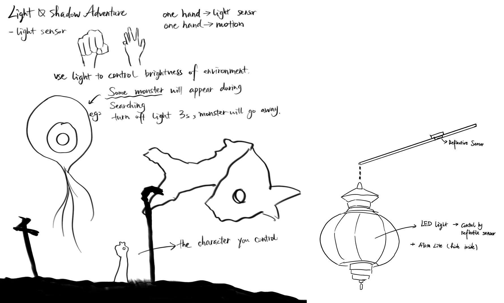

## Project 2 Light and Shadow adventure
Using a light sensor, a black-and-white forest scene is designed, 
and when the player shines a flashlight, 
the terrain or path will be displayed on the screen. 
Monsters will appear during the search process, and the light must be turned  

Here is one cover image:


### Part 1 - Introduction of my initial project idea
Here is my first two ideation of sketchs:  

This project uses the M5Stack development board and a reflective sensor as the game's control. It also controls the brightness of the lantern and the light and dark of the environment in which the little man in the game is located. When facing a monster, you need to turn off the light and wait three seconds to avoid the monster. The game is won or lost by avoiding the monster.




### Part 2 - Test Copper
After connecting to the M5, I first tested to see if the code for my copper's connection worked.  

```Python
import os, sys, io
import M5
from M5 import *
from hardware import *


pin8 = None


def setup():
  global pin8

  M5.begin()
  pin8 = Pin(8, mode=Pin.IN, pull=Pin.PULL_DOWN)


def loop():
  global pin8
  M5.update()
  if pin8.value():
    print('Connect Successful')


if __name__ == '__main__':
  try:
    setup()
    while True:
      loop()
  except (Exception, KeyboardInterrupt) as e:
    try:
      from utility import print_error_msg
      print_error_msg(e)
    except ImportError:
      print("please update to latest firmware")
```


### Part 3 - Figure out where my copper should place
Then I had to decide where I should put the copper, but because the hat is so soft,
the first and second places I looked were both a clip on the brim, and after putting the hat back on, 
there was compression, and the two copper overlapped. Unfortunately, because the hat is soft, the chances of success are not high.  

  

Then I had to decide where to put the copper. But because the hat was so soft, the first and second places I tried were both a clip on the brim, and after putting the hat back on, the two copper overlapped due to the pressure. Unfortunately, because the hat was so soft, the chances of success were not high.
I then decided to sew the copper to the brim of the hat, then sew a piece of fabric on, and then sew a copper on the inside. When the person puts on the hat and their head pushes up, the two copper can meet and connect the circuit.  

  

Here is the list of all the separate hardware components used in Hogwarts House Sorting Hat
* ATOM Lite: The core of the project, it controls the input/output and runs the program. It reads the circuit's state and controls the LEDs.  
* Extention of ATOM: In order to additional input/output ports and enhancing connectivity options.  
* RGB light stripe:  Represent the Hogwarts houses with different colors (red, blue, yellow, and green). They are connected to G2 and provide visual feedback during the sorting process.  
* Copper with wire: Act as sensors. When they touch, they close the circuit, triggering the sorting sequence.  

### Part 4 - How my interactive prototype should behave
diagram that represents how my interactive prototype should behave  

  

Allow me explain the inputs/outputs used in my code and how they affect the behavior of the prototype.
* Library Imports: These libraries handle system functions, M5Stack control, hardware interactions, time-based delays, and random number generation.
```Python
import os, sys, io
import M5
from M5 import *
from hardware import *
import time
import random
```  

* RGB Setup : Initializes a 30-LED RGB strip connected to Pin G2. The LED strip uses the SK6812 type.
```Python
rgb2 = RGB(io=38, n=30, type="SK6812")
```  

* Circuit Connection Initialization : Sets Pin G6 (GPIO Pin 1) as an input with an internal pull-up resistor. This pin detects the circuit's state (closed or open), i.e., whether the copper plates are touching.
```Python
circuit_pin = Pin(1, mode=Pin.IN, pull=Pin.PULL_UP)

```  

* House Color and Name Dictionaries : These dictionaries map each house to an RGB color and house name. The first dictionary assigns RGB values to each house (e.g., red for Gryffindor), and the second assigns their names.
```Python
house_colors = {
    1: (255, 0, 0),    # Gryffindor
    2: (0, 0, 255),    # Ravenclaw
    3: (255, 255, 0),  # Hufflepuff
    4: (0, 255, 0)     # Slytherin
}

house_names = {
    1: "Gryffindor",
    2: "Ravenclaw",
    3: "Hufflepuff",
    4: "Slytherin"
}

```  

* RGB Color Function : This function converts the individual red, green, and blue color values into a single integer (rgb_color) that can be used to set the LED color.
```Python
def get_rgb_color(r, g, b):
    global rgb2
    rgb_color = (r << 16) | (g << 8) | b
    return rgb_color

}
```

* Flash Lights Function : This function cycles through the four house colors—red, blue, yellow, and green—flashing each color for 0.5 seconds. The loop repeats this process three times.


```Python
def flash_lights():
    global rgb2
    i = 0
    while (i < 3):
        rgb2.fill_color(get_rgb_color(255, 0, 0))  # Red
        time.sleep(0.5)
        rgb2.fill_color(get_rgb_color(0, 0, 255))  # Blue
        time.sleep(0.5)
        rgb2.fill_color(get_rgb_color(255, 255, 0))  # Yellow
        time.sleep(0.5)
        rgb2.fill_color(get_rgb_color(0, 255, 0))  # Green
        time.sleep(0.5)
        i += 1

```

* House Selection Function : This function randomly selects a house (using random.randint(1, 4)), retrieves the corresponding color and house name, sets the RGB LEDs to that color, and prints the house name.

```Python
def select_house():
    global rgb2
    house = random.randint(1, 4)
    color = house_colors[house]
    rgb2.fill_color(get_rgb_color(*color))
    print(house_names[house])  # Announce house name
    return house_names[house]

```

* Main Loop : In the main loop, the code constantly checks if the circuit is completed (i.e., if the copper plates are touching). Once the circuit is complete (circuit_pin.value() == False), it triggers the flashing lights, selects a house, and breaks the loop after running one cycle. The program ends after announcing the selected house.

```Python
while True:
    M5.update()

    # Detect if circuit is completed (Pin G6)
    if circuit_pin.value() == False:
        flash_lights()
        time.sleep(2)  # Pause before final selection
        selected_house = select_house()
        print(f"You are in {selected_house}!")
        break  # Exit after one cycle
    time.sleep(0.1)  # Small delay to prevent overload

```


And here is my code link:  

[Hogwarts House Sorting Hat Code](main.py)

### Part 5 - Some video records for sort into different house
Here is a video I recorded using the branch hat to divide into the different Hogwarts houses.
Gryffindor

Ravenclaw

Hufflepuff

Slytherin


