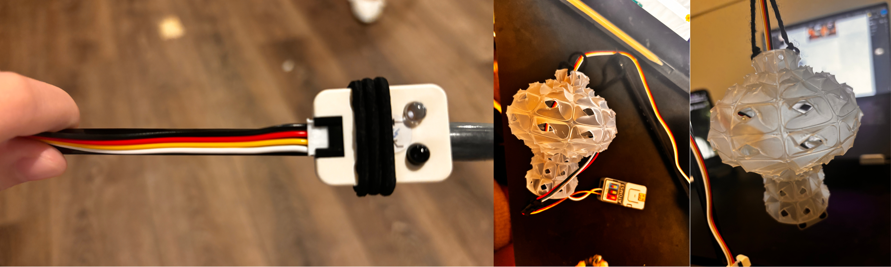
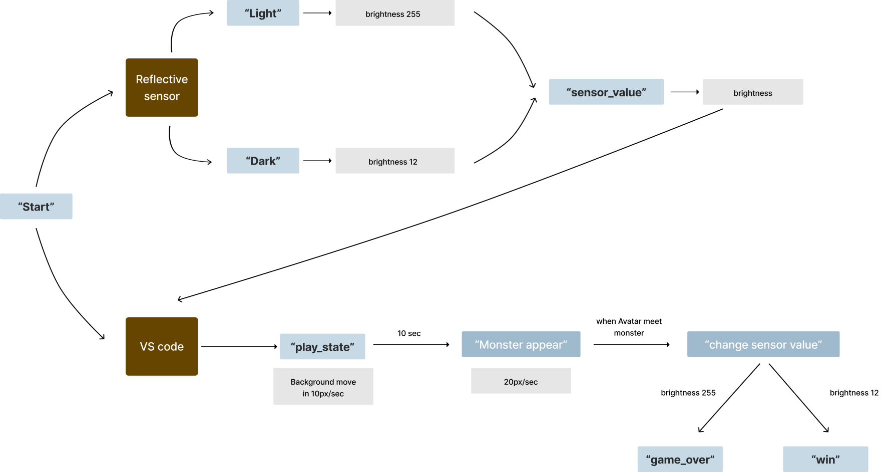

## Project 2 Light and Shadow adventure
Using a light sensor, a black-and-white forest scene is designed, 
and when the player shines a flashlight, 
the terrain or path will be displayed on the screen. 
Monsters will appear during the search process, and the light must be turned  

Here is one cover image:


### Part 1 - Introduction of my initial project idea
Here is my first two ideation of sketchs:  

This project uses the M5Stack development board and a reflective sensor as the game's control. It also controls the brightness of the lantern and the light and dark of the environment in which the little man in the game is located. When facing a monster, you need to turn off the light and wait three seconds to avoid the monster. The game is won or lost by avoiding the monster.


### Part 2 - Process of making lanterns
I created a lantern model in Rhino and printed it with translucent material. 
The lantern design uses a geometric pattern, which is then made into a three-dimensional pattern 
and applied to the simple lantern shape I designed to reflect light in different directions (in total darkness). 
I also created a stick to hold it up, and I hid the M5 lite, LED and extension inside the lantern.

  
  

Here is the list of all the separate hardware components used in Hogwarts House Sorting Hat
* ATOM Lite: The core of the project, it controls the input/output and runs the program. It reads the circuit's state and controls the LEDs.  
* Extention of ATOM: In order to additional input/output ports and enhancing connectivity options.  
* RGB light stripe:  Represent the Hogwarts houses with different colors (red, blue, yellow, and green). They are connected to G2 and provide visual feedback during the sorting process.  
* Reflective Sensor: Controls the brightness of a physical lantern and adjusts game lighting based on ambient light, enhancing immersion by syncing physical and digital lighting. 

### Part 4 - How my interactive prototype should behave
diagram that represents how my interactive prototype should behave  

  

Allow me explain the inputs/outputs used in my code and how they affect the behavior of the lantern in Thonny.
* The code imports necessary modules, including the M5 library, time library, m5utils, and hardware module, enabling interaction with the M5Stack board and connected hardware components.
```Python
import os, sys, io
import M5
from M5 import 
import time
import m5utils
from hardware import 

```  

* An infinite while loop is used to continuously update the M5Stack's status (M5.update()), read sensor data, and control the RGB light strip's brightness. time.sleep_ms(50) adds a delay to control the loop’s execution frequency.
```Python
while True:
    M5.update()
    ...
    time.sleep_ms(50)
```  

* The set_brightness(scaled_val) function is called to apply the remapped brightness value to the RGB light strip.
* print(scaled_val) outputs the brightness value to the console for debugging and monitoring.
```Python
set_brightness(scaled_val)
print(scaled_val)

```

* RGB(io=38, n=30, type="SK6812") configures an RGB light strip connected to Pin 38, with 30 LEDs of type SK6812.
* ADC(Pin(7), atten=ADC.ATTN_11DB) sets up the ADC on Pin 7 with an attenuation setting of 11DB, increasing the ADC's input range.
```Python
rgb2 = RGB(io=38, n=30, type="SK6812")
adc = ADC(Pin(7), atten=ADC.ATTN_11DB)
```

* The set_brightness(brightness) function calculates the RGB color value for the light strip based on the brightness parameter.
* (brightness << 16) | (brightness << 8) | brightness converts the brightness level into an RGB color value representing white (R=G=B) with varying intensity.
* rgb2.fill_color(rgb_color) applies the computed color value to the entire RGB strip.

```Python
def set_brightness(brightness):
    rgb_color = (brightness << 16) | (brightness << 8) | brightness  # White with varying brightness
    rgb2.fill_color(rgb_color)

```
